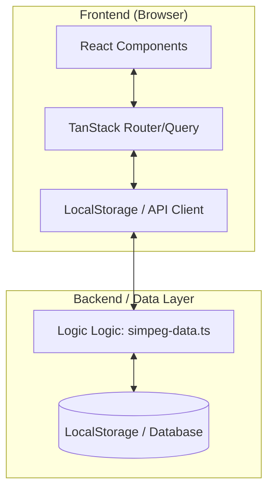

# Technical Architecture - SIMPEG

Dokumen ini merinci arsitektur teknis sistem, mencakup lapisan Frontend (FE) dan Backend (BE).

---

## 1. Arsitektur Frontend (FE)

Sistem menggunakan arsitektur **Single Page Application (SPA)** modern dengan performa tinggi.

### Tech Stack FE:

- **Core**: React 19 (Versi terbaru dengan optimasi rendering).
- **Build Tool**: Vite (Instan HMR dan build sangat cepat).
- **Routing**: TanStack Router (Type-safe routing, menangani parameter dan pencarian secara aman).
- **State Management**:
  - **Server State**: TanStack Query (Menangani caching dan sinkronisasi data).
  - **Global State**: React Context API (Untuk Auth dan Theme).
- **Styling**: Tailwind CSS v4 + Shadcn UI (Utilitas CSS berbasis komponen).

### Struktur Komponen:

```text
[View Layer (Routes)] -> [Logic Layer (Hooks)] -> [Data Layer (API/Storage)]
```

- **Routes**: Menangani tampilan halaman (Dashboard, Profile, dll).
- **Hooks**: Memisahkan logika bisnis dari UI (Contoh: `useAuth`, `useMobile`).
- **Lib/Utils**: Fungsi pembantu seperti perhitungan tanggal pangkat dan KGB.

---

## 2. Arsitektur Backend (BE)

### Fase 1: Implementasi Saat Ini (Mock Architecture)

Untuk keperluan prototipe dan kecepatan, sistem saat ini menggunakan **Client-Side Persistence**.

- **Data Store**: Browser LocalStorage.
- **Logic Provider**: `src/lib/simpeg-data.ts` bertindak sebagai "Controller" yang mengelola operasi CRUD (Create, Read, Update, Delete).
- **Security**: Mock JWT (menyimpan ID user di localStorage) untuk mensimulasikan sesi login.

### Fase 2: Rencana Produksi (Proposed Architecture)

Jika sistem dikembangkan ke skala produksi (Enterprise), berikut adalah arsitektur yang direkomendasikan:

#### Stack BE:

- **Runtime**: Node.js / Bun.
- **Framework**: Express.js atau Fastify.
- **Database**: PostgreSQL (Relational DB sangat cocok untuk data pegawai yang terstruktur).
- **ORM**: Prisma (Untuk type-safety antara DB dan BE).

#### Skema Arsitektur BE:

1.  **API Layer**: RESTful API untuk melayani permintaan dari Frontend.
2.  **Service Layer**: Berisi logika bisnis (Hitung otomatis pangkat, validasi dokumen).
3.  **Auth Layer**: Passport.js atau Clerk untuk autentikasi JWT yang aman.
4.  **Worker Layer**: Background job untuk mengirim email/WA reminder secara otomatis setiap jam 08:00 pagi.

---

## 3. Alur Komunikasi Data (Data Flow)



---

## 4. Keamanan Arsitektur

- **RBAC (Role-Based Access Control)**: Filter menu dan aksi di sisi client berdasarkan payload user role.
- **Data Validation**: Menggunakan library **Zod** untuk memastikan data yang masuk (input admin) sesuai format (NIP valid, Email valid).
- **Encryption**: Password disimpan dalam bentuk plain-text di prototipe ini, namun pada fase produksi wajib menggunakan **Bcrypt** untuk hashing.

---

## 5. Deployment Architecture

- **Environment**: Aplikasi dapat di-deploy ke **Vercel** atau **Netlify** sebagai static site.
- **CI/CD**: Setiap perubahan pada branch `main` akan memicu otomatis build dan pengujian melalui GitHub Actions.
