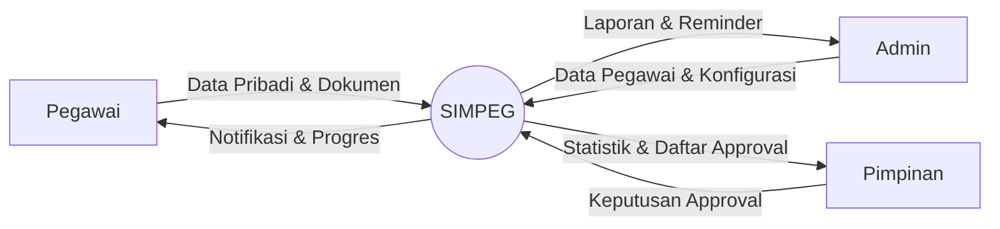
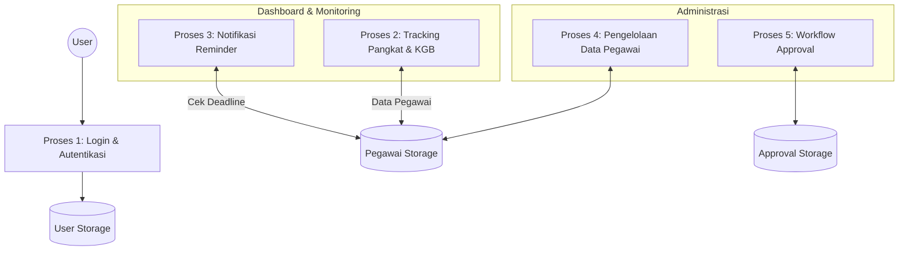

# Data Flow Diagram (DFD) - SIMPEG

Sistem Informasi Kepegawaian menggunakan diagram alir data untuk menggambarkan bagaimana informasi bergerak melalui sistem.

## Level 0: Context Diagram

Menggambarkan interaksi antara entitas luar dengan sistem SIMPEG secara keseluruhan.

## Level 1: Process Diagram

Detail proses utama dalam sistem.

