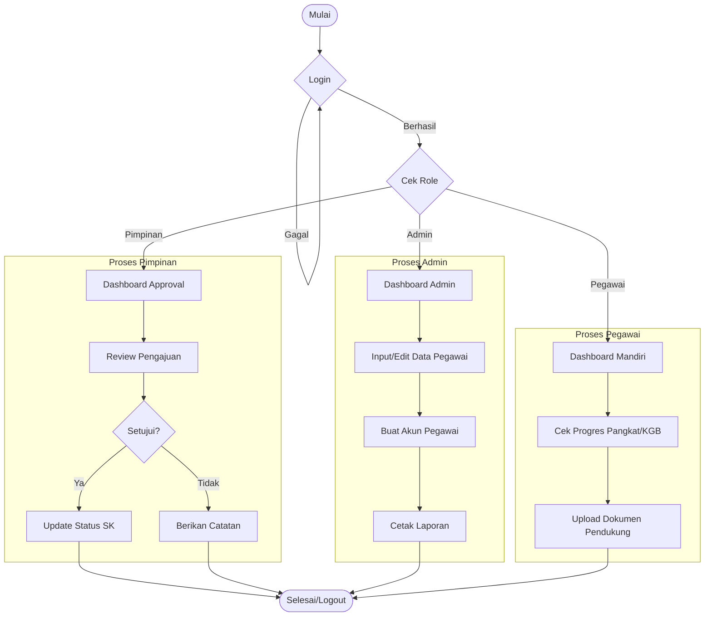

# Flowchart Sistem SIMPEG

Diagram ini menggambarkan alur kerja pengguna dari login hingga pengelolaan data.

## Alur Utama Pengguna

```mermaid
flowchart TD
    Start([Mulai]) --> Login{Login}
    Login -- Gagal --> Login
    Login -- Berhasil --> RoleCheck{Cek Role}
    
    RoleCheck -- Admin --> AdminDash[Dashboard Admin]
    RoleCheck -- Pegawai --> PegawaiDash[Dashboard Mandiri]
    RoleCheck -- Pimpinan --> PimpinanDash[Dashboard Approval]
    
    subgraph "Proses Admin"
        AdminDash --> ManagePegawai[Input/Edit Data Pegawai]
        ManagePegawai --> CreateAccount[Buat Akun Pegawai]
        CreateAccount --> ViewReports[Cetak Laporan]
    end
    
    subgraph "Proses Pegawai"
        PegawaiDash --> CheckStatus[Cek Progres Pangkat/KGB]
        CheckStatus --> UploadDoc[Upload Dokumen Pendukung]
    end
    
    subgraph "Proses Pimpinan"
        PimpinanDash --> ReviewDoc[Review Pengajuan]
        ReviewDoc --> Decision{Setujui?}
        Decision -- Ya --> Approve[Update Status SK]
        Decision -- Tidak --> Reject[Berikan Catatan]
    end
    
    Approve --> Finish([Selesai/Logout])
    Reject --> Finish
    ViewReports --> Finish
    UploadDoc --> Finish
```
