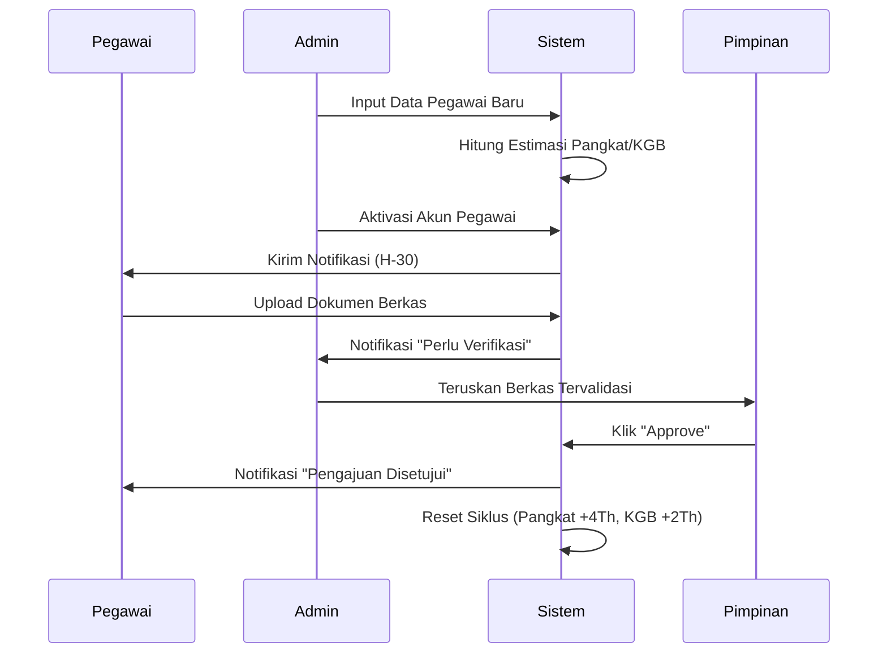

# Workflow Detail Sistem SIMPEG

Dokumen ini menjelaskan alur kerja operasional untuk setiap fitur utama berdasarkan peran pengguna (Role-Based Workflow).

---

## 1. Role & Hak Akses

| Role         | Deskripsi Fokus                   | Hak Akses Utama                                                |
| :----------- | :-------------------------------- | :------------------------------------------------------------- |
| **Admin**    | Pengelola Data & Sistem           | Manajemen Pegawai, Pembuatan Akun, Monitoring Global, Laporan. |
| **Pegawai**  | Pengguna Mandiri                  | Cek Progres Pribadi, Upload Dokumen, Notifikasi Personal.      |
| **Pimpinan** | Verifikator & Pengambil Keputusan | Approval Dokumen, Monitoring Statistik, Review Pengajuan.      |

---

## 2. Workflow Fitur Utama

### A. Manajemen Data & Akun (Admin)

1. **Input Data**: Admin memasukkan data profil pegawai (NIP, Nama, TMT Pangkat/KGB).
2. **Otomatisasi Sistem**: Sistem langsung menghitung tanggal estimasi kenaikan pangkat (+4 thn) dan KGB (+2 thn) setelah data disimpan.
3. **Pembuatan Akun**:
   - Admin memilih pegawai yang belum memiliki akses.
   - Admin mengklik "Buat Akun".
   - Sistem men-generate username (NIP) dan password default.
   - Akun aktif dan siap digunakan oleh pegawai untuk login mandiri.

### B. Monitoring & Reminder (Otomatis)

1. **Pengecekan Rutin**: Setiap kali sistem diakses, logic `daysUntil` menghitung selisih hari antara hari ini dan tanggal jatuh tempo.
2. **Trigger Notifikasi**:
   - **H-30 s/d H-15**: Notifikasi muncul dengan warna biru/hijau (Informasi).
   - **H-14 s/d H-8**: Notifikasi berubah warna menjadi kuning/orange (Peringatan).
   - **H-7 s/d Hari-H**: Notifikasi menjadi merah (Urgent).
3. **Distribusi**:
   - **Admin**: Melihat reminder untuk _seluruh_ pegawai agar bisa menyiapkan berkas kolektif.
   - **Pegawai**: Hanya melihat reminder untuk _dirinya sendiri_.

### C. Alur Pengajuan & Approval (End-to-End)

1. **Inisiasi (Pegawai)**:
   - Pegawai mendapat reminder atau melihat progres di dashboard.
   - Pegawai menuju halaman "Kenaikan Pangkat" atau "KGB".
   - Pegawai mengunggah dokumen yang diperlukan (PDF).
2. **Verifikasi (Admin)**:
   - Admin melihat notifikasi ada dokumen baru masuk.
   - Admin memeriksa kelengkapan berkas di menu "Approval".
   - Jika lengkap, Admin memberikan status "Verified" dan meneruskan ke Pimpinan.
3. **Keputusan (Pimpinan)**:
   - Pimpinan meninjau berkas melalui dashboard Pimpinan.
   - Pimpinan memilih "Approve" (Setuju) atau "Reject" (Tolak).
   - Jika **Approve**: Sistem memperbarui TMT Terakhir pegawai dan menjadwalkan ulang periode berikutnya secara otomatis.
   - Jika **Reject**: Pegawai menerima notifikasi penolakan beserta catatan alasannya.

---

## 3. Alur Logika Per Fitur (Detail Teknis)

### Fitur Search (Admin)

- **Input**: NIP atau Nama.
- **Proses**: Filter array `mockPegawai` secara real-time.
- **Output**: Link navigasi ke profil detail pegawai untuk audit cepat.

### Fitur Progres Karir (Pegawai)

- **Input**: Auth Context (NIP User Login).
- **Proses**: Mencocokkan NIP login dengan data di `Pegawai Storage`.
- **Output**: Visualisasi kartu countdown (jumlah hari tersisa) menuju Pangkat/KGB.

### Fitur Laporan (Admin)

- **Proses**: Agregasi data pegawai yang jatuh tempo pada bulan tertentu.
- **Output**: File PDF/Excel yang siap dicetak untuk lampiran rapat dinas.

---

## 4. Diagram Interaksi Antar Role

